================================
git Source Code Management Guide
================================
This guide will cover installing git on Windows systems with msysgit,
setting up a GitHub.com account for remote code hosting and
collaboration, and allowing git to connect to GitHub for pushing and
pulling changes.

Additionally, this guide will introduce you to git with a short
tutorial.

.. contents::

---------------------------
Installing git with msysgit
---------------------------
The first step is to install git on your system. On linux this is as
simple as using the package manager to download and install the
application for you, and on Mac computers you can install git with
MacPorts. On Windows you'll need a helper program like msysgit_.
msysgit creates a unix-like environment in which git can run. You can
either use the standard command-line git application through it, or
work through the graphic interface provided by msysgit.

At the time of writing the latest release of msysgit was
`Git-1.7.0.2-preview20100309`_, so download that and run it.

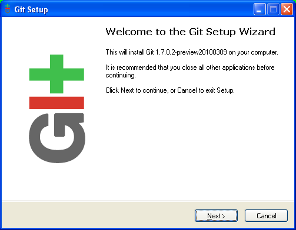
    
    MSysGit installer

After the Welcome Screen, you'll be asked to read the GNU public
license, which msysgit is licensed under. You don't have to agree to it
to use the application, only if you are redistributing or altering the
application.

The next screen is a standard install location. It is recommended to
leave this on the default value (``Program Files/Git``) unless you have
another install location.

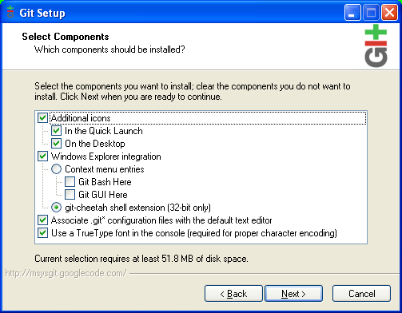
    
    Install options
    
    Icons, Explorer integration, command-line fonts and config file
    association

Next is an install options screen. You have the option of not placing
new icons on your desktop and in the quick launch menu on the taskbar,
which I leave to your preference. The second option group, Windows
Explorer Integration, offers to either add context menu entries (one
that opens a unix command line in the current folder, and another that
opens the graphical interface,) or to install git-cheetah (an in
progress TortoiseSVN clone for git.) Choose the context menu options
instead of git-cheetah for now. The last two options I recommend
leaving alone.

The next screen asks where or if you'd like to install a Start Menu
entry. As this guide will assume you can access the application through
the Start Menu, please allow it to do so.

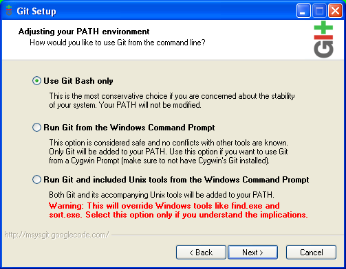
    
    Configuration options
    
    How the PATH environment variable should be handled.

The next screen asks you about the PATH environment variable, which
tells the operating system where to find utility programs. I highly
recommend selecting the "Use Git Bash only" option, which makes no
changes to the PATH variable.

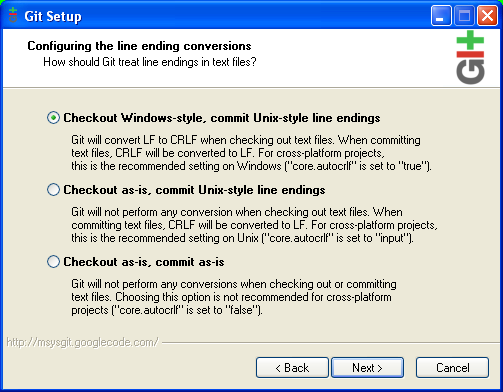
    
    Configuration options
    
    How line-ends should be handled.

The final screen asks about line-ending characters. On Unix-like systems
the line-ending character is a single new-line character (``\n``), while
on Windows the line-ending characters are a carriage-return and
new-line (``\r\n``). This means that text files coming to windows from
a unix machine will appear all on one line, while files coming from
windows to a unix machine will have an extra trailing character on
each line. Choose "Checkout Windows-style, commit Unix-style line
endings," which will automatically convert files to windows line-ends
when you get them, and convert them to unix style when you commit them
to the repository.

The install of msysgit is complete. You can review the release notes or
just close out the installer.

.. _msysgit: http://code.google.com/p/msysgit/

.. _Git-1.7.0.2-preview20100309: http://msysgit.googlecode.com/files/Git-1.7.0.2-preview20100309.exe

------
GitHub
------
Once the local software is installed, the second step is to get the
code we are going to be working on, but we have some pre-requisites: the
service I am using to host the code is protecting the repository, so we
need to get in to that system first.

.. note::
    
    GitHub is an external service that hosts git repositories. You do
    not need a GitHub account to use git itself, or even public
    repositories hosted on GitHub, you only need a GitHub account to be
    able to access the private repositories hosted there.

For me the be able to add you to the repository, you will need a
`GitHub user account`_ (there are several pay options offered for larger
needs, choose the free option as we will not be needing the features
offered in those plans.)

.. _GitHub user account: http://github.com/plans

SSH
---

Github has two methods of user authorization, a standard user/pass
combination for the website, and an SSH (Secure SHell) key for
authorizing git transactions.

The easiest way to get an SSH key is through the Git Bash command-line.

Open Git Bash with **Start > Git > Git Bash**.

Bold text is what you'll need to type here.

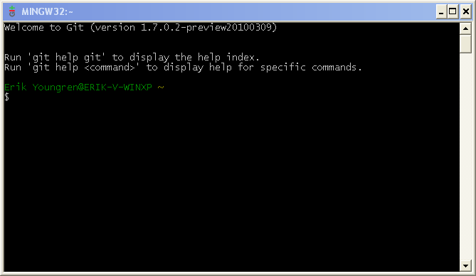
    
    Git Bash command-line shell.

.. parsed-literal::
    
    Welcome to Git (version 1.7.0.2-preview20100309)
    
    Run 'git help git' to display the help index.
    Run 'git help <command>' to display help for specific commands.
    
    user@windows ~
    $ **ssh-keygen -t rsa "user@example.com"**
    Generating public/private rsa key pair.
    Enter file in which to save the key (/c/Documents and Settings/user/.ssh/id_rsa):

In place of ``user@example.com`` use your own email address. If you
would rather not put your email address here use ``ssh-keygen -t rsa``
instead and ssh-keygen will use your login and machine name.

Leave the filename blank to just use the default file (``.ssh/id_rsa``
in your home folder.)

.. parsed-literal::
    
    Created directory '/c/Documents and Settings/user/.ssh/'.
    Enter passphrase (empty for no passphrase):

Enter a passphrase to protect your SSH key with (you may leave this
blank.) You will need this passphrase to unlock the SSH key when you
use it.

ssh-keygen will tell you where it saved the id_rsa and id_rsa.pub
files, and the fingerprint of the key.

At this point you need to open the ``id_rsa.pub`` file, because we need
the data inside. So go to ``C:\Documents and Settings\`` and click on
your user name (it will be the same name in the place of ``user``
above.) Open the ``.ssh`` folder and open ``id_rsa.pub`` with Notepad.
You should see a lot of random numbers and letters. Make sure you have
``id_rsa.pub`` and not ``id_rsa``.

This is the public version of your new ssh key, used to validate data
signed by the private key (``id_rsa``,) and GitHub will need this to
authenticate your git transactions.

If you aren't, log in to GitHub and click on "Account Settings" in the
top right corner. Under the "Account Overview" tab, click
"SSH Public Keys" and then "Add a public key." Ignore the title field
that appears, copy the gibberish from ``id_rsa.pub`` into the
"Key" field and press "Add key."

-------------------------------------------
Working with git and GitHub through msysgit
-------------------------------------------
Once all that is done, send me a message with your GitHub user name and
I will add you to the class project repository.

This step may take a while if you do this while I am not available.
Since we have all the pieces needed to use git with GitHub, in the mean
time I will run a small tutorial.

Example Repository: git-guide
-----------------------------
I have hosted this very document on GitHub in a public repository, so
first take a look at what is there: head over to
http://github.com/Artanis/git-guide. I'll leave it to you to explore
the site itself (if you have questions post them.) You'll see there's a
few files there, as well as the last commit that was pushed here, and
some other things.

Cloning a repository
~~~~~~~~~~~~~~~~~~~~
But what you want this stuff on your machine. That's the point, right?

Close out Git Bash and ``id_rsa.pub`` if you haven't already, and open
Git GUI. **Start Menu > Git > Git GUI**.

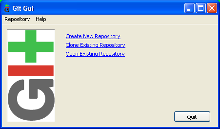
    
    MSysGit

You'll see a window that offers three links:

* **Create a New Repository**, a new blank repository.
* **Clone and Existing Repository**, copy an existing repository
* **Open Existing Repository**

Since we are getting an existing repository, and we don't have it yet
to open it, choose to clone an existing repository.

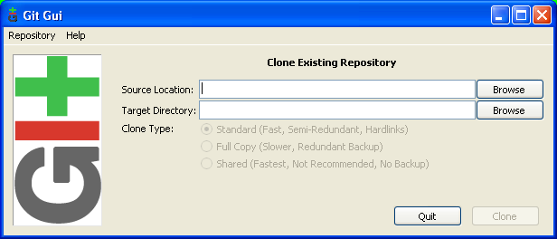
    
    MSysGit clone.

In the "Source Location" text box, enter
``git://github.com/Artanis/git-guide.git``, the url of the actual
repository. In the "Target Directory" text box, browse for a place
you'll remember, like "My Documents," and rather counter-intuitively
type ``git-guide`` the name of repository. Msysgit will not clone into
an existing folder, so it is imperative that the folder not exist prior.

Once you have a destination for the code, click "Clone." A few screens
will flicker by quickly, and then you will have the main Git GUI
application. It is important to know that Git GUI is not a code editor
or IDE. Its sole purpose is to manage the git repository. The various
panes only show anything when files have changed, so it looks pretty
bare right now.

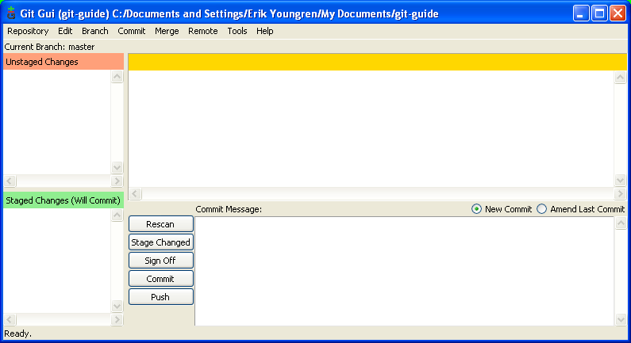
    
    A repository with no changes in it.

Once you clone a repository, you have the most recent changes, so
there's not much to do besides look at the repository history, edit
files, or wait for new changes.

On those notes, we have three tasks: show repo history, edit files, and
get changes.

Repository History
~~~~~~~~~~~~~~~~~~
The most interesting one for this repository is going to be the history.
Under **Repository** choose **Visualize master's History**. ``master``
is the current *branch* of the repository. Feel free to explore the
history for a bit. Changes in lines are marked by ``+`` for additions,
and ``-`` for deletions.

Pulling and Merging Changes
~~~~~~~~~~~~~~~~~~~~~~~~~~~
To check for changes, go to the **Remote** menu. Look under **Fetch**
and you'll see that the ``origin`` remote-branch is listed, the remote
repository's (at GitHub) ``master`` branch. When you select a remote
branch from Fetch, Git fetches all the changes (if any) from that
remote much like a mail client grabs new emails. What it doesn't do is
put them in your ``master`` branch. It's unlikely with this example
repository, but when there are changes you go over to **Merge** and
choose **Local Merge**. All goes well, you'll have a success message and
the changes will now be in your ``master`` branch.

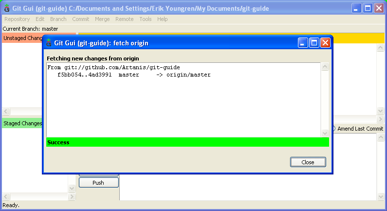
    
    Fetching changes.

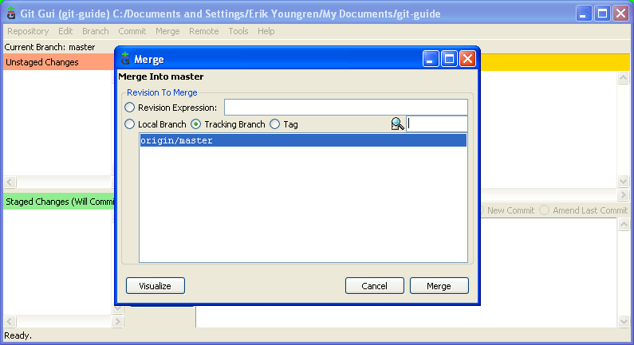
    
    Merging changes.

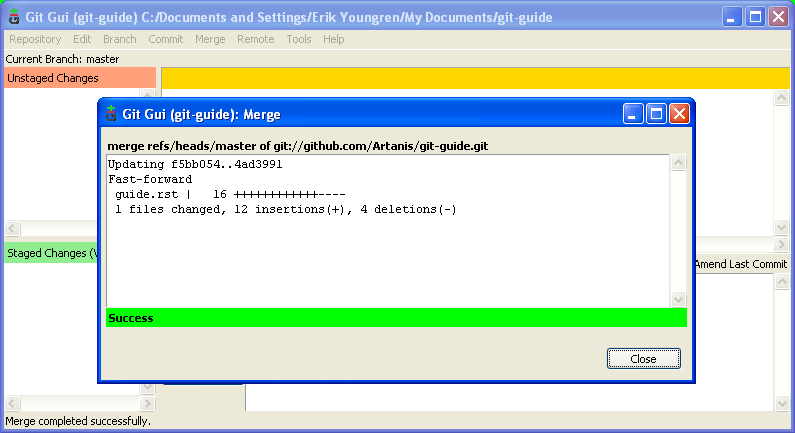
    
    Merging changes.

Making Changes
~~~~~~~~~~~~~~
Since Git GUI does not edit files, to edit files they need to be opened
in another application. Whatever you use to edit files of that type is
fine. To get to these files, under the **Repository** menu again, choose
**Explore Working Copy**. The working copy is the code that is checked
out of the repository into the directory structure. It may be an old
version, or the current version with or without changes.

Since you have the working directory open, open up the ``README.rst``
file. We're going to change it. Just write in it. Anything is fine, and
save the file. (To keep git sane, make sure there is exactly one blank
line at the end files when you are done editing.)

Switch back to Git GUI and hit the "Rescan" button. You'll see
``README.rst`` now appears in the "Unstaged Changes" pane. Select it
and a diff (machine-readable list of differences) similar to what you
saw in the history appears in the "Modified, not staged" pane.

Lets get these changes checked in.

Creating a Commit
~~~~~~~~~~~~~~~~~
Click the icon next to ``README.rst`` in "Unstaged" and it will jump to
"Staged Changes." Select it again and the diff is now labeled "Staged
for commit." Type a descriptive message in the Commit Message text
area--"Tutorial commit" will work here--and click "Commit."

The interface will now revert to the boring blank view. No changes.
Open up history and take a look at your work. Now you'll see that
``master`` is your commit, and the remote branch ``origin/master`` is
still on it's last commit.

Pushing Changes
~~~~~~~~~~~~~~~
Since you don't have push access to this example repo, it's kind of
hard to tutorial that part, but here's how it works.

Once you have commits that you want to put on the server, press the
"Push" button below "Commit." A window will appear allowing you to
select a source branch (usually ``master``,) and a remote (in this case,
``origin``.) Pressing "Push" there will establish a connection with
GitHub (you'll be asked to confirm the rsa fingerprint, which should be
``16:27:ac:a5:76:28:2d:36:63:1b:56:4d:eb:df:a6:48``,) and to unlock your
``id_rsa`` ssh key with the passphrase. Once you do that, git
establishes an authenticated connection with GitHub and sends all the
changes on the selected branch to the remote repository.

..  The github repository for the class project will be
    https://github.com/Artanis/CSC220-Class-Project (since this is a
    private repository you will not be able to view this until a few
    steps in.)

